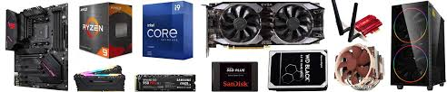
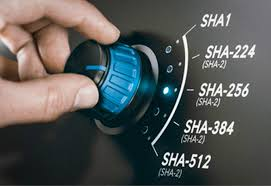

# Primera práctica
## *Destripando el ordenador*
---
En la primera práctica en clase, se nos enseña un ordenador por dentro, sus componentes, tipos de conectores, etc.

Se nos enseña un arranque por usb, tanto en modo **"live"** como instalando el S.O. y a través de internet.

Con el programa **Rufus** que sirve para quemar los .ISO en los pen drive, también sirve para comprobar el checksun.

Se nos manda a relizar la práctica en casa en la instalación del kubuntu, con unos tamaños fijados y utilizar el clonezilla.