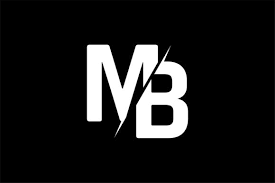
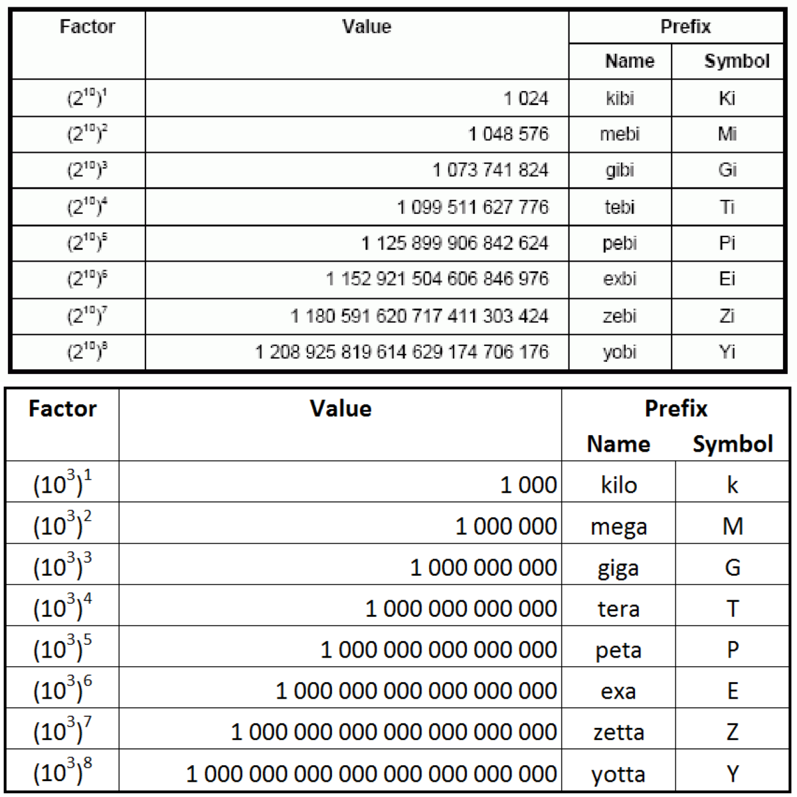
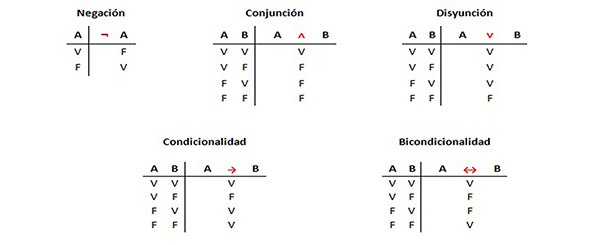

# ¿Mib y MB lo mismo?
## infierno de las puertas lógicas
---
En la clase de teoría se nos habla del reservado del sistema de windows, que no es totalmente imprescindible.
Las diferencias entre MiB y MB.
Las puertas lógicas y sus dibujos.

